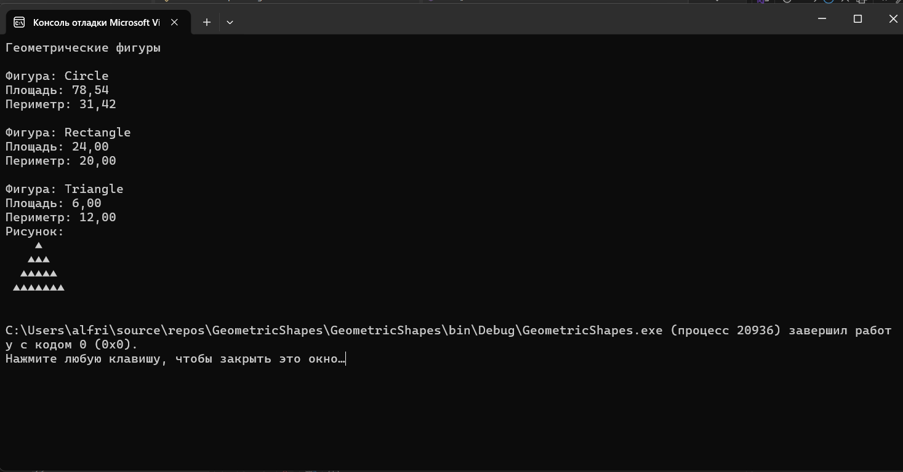

## Задание «Контрольная точка №11 — реализация интерфейсов»
## Вариант 1. Геометрические фигуры
1. IShape { double Area(); double Perimeter(); } — базовый интерфейс.
2. IDrawable : IShape { string Draw(); } — расширяющий интерфейс, возвращающий текстовое представление фигуры (например, упрощённый ASCII-рисунок).
3. Реализуйте Circle и Rectangle, реализующие только IShape.
4. Реализуйте Triangle, реализующий IDrawable (а значит, и IShape).
5. Соберите все фигуры в List<IShape>, обойдите в цикле: выведите площадь и периметр каждой, а для тех, что дополнительно реализуют IDrawable (проверка через is), дополнительно выведите результат Draw().

## Ожидаемый результат:
| Элемент | Ожидаемое поведение в цикле |
|---|---|
| `Circle` | выводятся `Area()` и `Perimeter()`; `Draw()` не вызывается |
| `Rectangle` | выводятся `Area()` и `Perimeter()`; `Draw()` не вызывается |
| `Triangle` | выводятся `Area()`, `Perimeter()` и дополнительно `Draw()` |

## Результат: 

